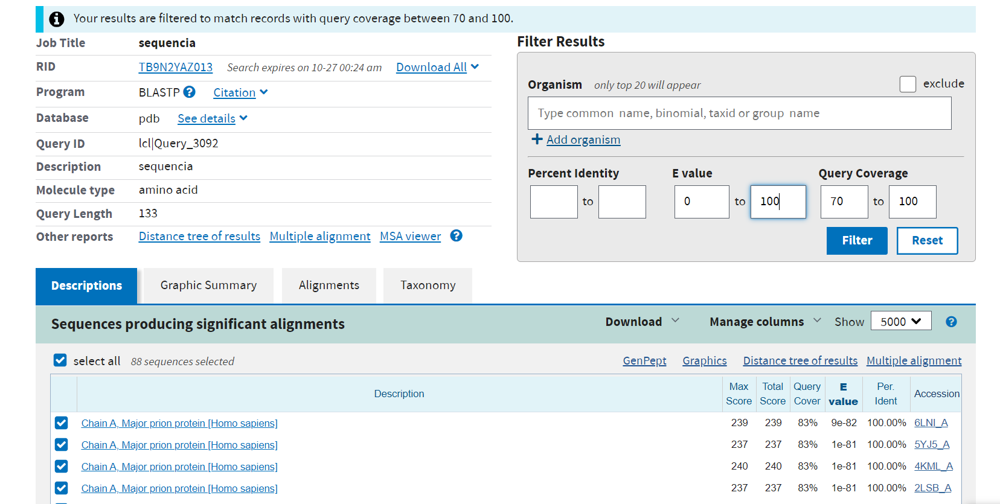
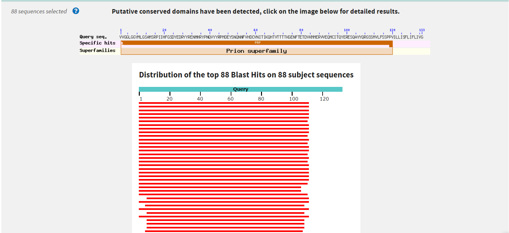
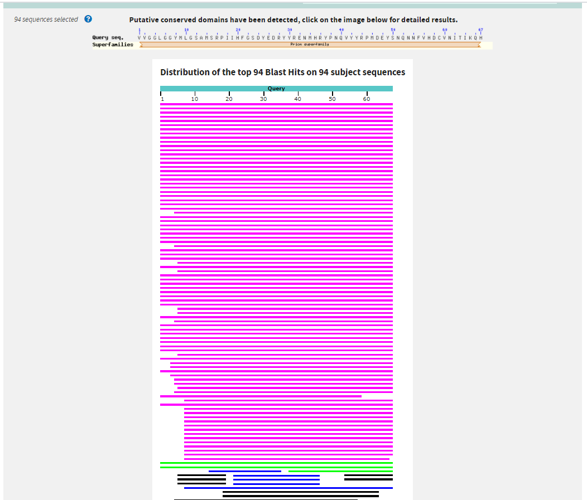
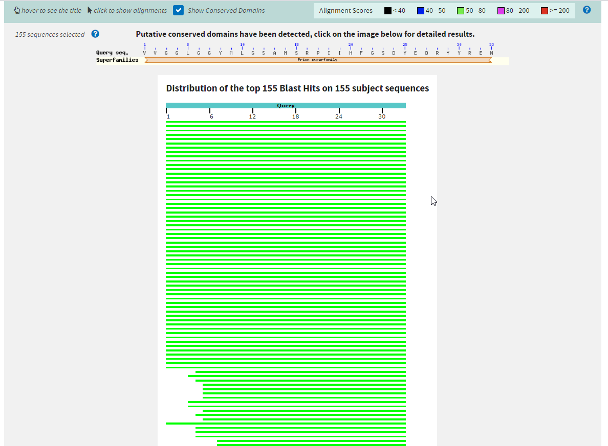

## Trabajo práctico 5. 

### - ¿Qué tipo de información se puede extraer de la comparación de secuencias?¿Cómo esperás que se vea en una comparación?

Podemos obtener información sobre la funcionalidad o evolución de esa secuencia. Creemos que se debe obtener esa información alineando las secuencias y comparando elemento por elemento. 

### - ¿Por qué crees que es mejor evaluar las relaciones evolutivas lejanas comparando proteínas?

EScribir lo que dije  
https://www.scielo.br/scielo.php?script=sci_arttext&pid=S0104-59702012000300006

### -  RETO I: Intentemos, entonces alinear estas dos palabras, para comprender mejor el problema. Alineá en la tabla interactiva las palabras "BANANA" y "MANZANA".
¡Tomá nota de tus observaciones y de las conclusiones que se desprendan de estas observaciones!

Se desprende que se intenta realizar una comparación uno a uno entre caracteres. Para ello se necesita utilizar guiones para poder comparar cadenas de distintos "largo". Podemos observar que hay un alineamiento básico entre ambas cadenas, ya que se usa el primer carácter como base para la comparación. Por ejemplo, si el gap de banana es puesto delante de la secuencia de caracteres se puede observar que hay más coincidencias entre ellas.

### - RETO II: En la siguiente tabla interactiva distintos alineamientos para las palabras "ANA" y "ANANA". Verás que en el margen superior derecho aparece un valor de identidad calculado para cada alineamiento que intentes. ¡Tomá nota de los valores de identidad observados y de las conclusiones que se desprendan de estas observaciones!

A medida que tenemos un mayor número de coincidencias, dicho número aumenta. 
No todos los valores son iguales porque depende de qué tanto tengamos que alterar la cadena que estamos comparando para hacerlas coincidir. A la hora de realizar el cálculo deberíamos considerar desde dónde alineamos, la cantidad de gaps, la cantidad de coincidencias, la cantidad de desencuentros, etc.
También podríamos notar diferencias entre cadenas que coinciden sin gaps, contra cadenas que coinciden pero que contienen gaps. Esto hace que no todos los ordenamientos posibles sean válidos para la biotecnología porque un ordenamiento demasiado disruptivo en la cadena podría generar que la cadena pierda sus características principales. 

### - RETO III: En la siguiente tabla probá distintos alineamientos para las palabras "ANA" y "ANANA". Verás que en el margen superior izquierdo aparece un valor de identidad calculado para cada alineamiento que intentes y un botón para cambiar la penalidad que se le otorga a dicho para el cálculo de identidad.
Probá varias combinaciones, tomá nota de los valores de identidad observados y de las conclusiones que se desprendan de estas observaciones.

Notamos que a medida que la penalidad aumenta la identidad decrece. Es decir, el valor de la identidad es inversamente proporcional a la penalidad. Si aumentaramos la penalidad dada a los gaps esto provocaría una reducción de posibilidades de reordenamiento.
Como una nueva forma de penalización podríamos pensar en penalizar si la cadena empieza o termina con un gap o no

### PARA PENSAR: Entonces, pensando en un alineamiento de ácidos nucleicos ¿Cuáles te parece que son las implicancias de abrir un gap en el alineamiento? ¿Qué implicaría la inserción o deleción de una región de más de un residuo?

Creemos que si vamos agregando gaps a la secuencia de ácidos nucléicos podría ser afectada la manera en que se decodifica la información que aportan esos genes para la síntesis de proteínas. 

### - RETO IV: En la siguiente tabla probá distintos alineamientos para las secuencias nucleotídicas. Podrás ver las traducciones para cada secuencia. Probá varias combinaciones, tomá nota de las observaciones y de las conclusiones que se desprendan de estas.

### PARA PENSAR: ¿Dá lo mismo si el gap que introducís cae en la primera, segunda o tercera posición del codón? ¿Cómo ponderarías las observaciones de este ejercicio para evaluar el parecido entre dos secuencias?

Cada vez que falta una letra en alguno de los 3 espacios no se forma el codon. Si variamos la manera en que agrupamos las letras se van formando distintos codones. Lo mismo pasa si cambiamos la posición de los gaps. 

### - RETO V: Estuvimos viendo que el alineamiento de secuencias no es trivial y requiere contemplar los múltiples caminos posibles, teniendo en cuenta al mismo tiempo la información biológica que restringe ese universo de posibilidades.  
###   ¡Es momento de llevar entonces estos conceptos a lo concreto!  
###   Te proponemos pensar los pasos a seguir en un alineamiento de dos secuencias cortas, teniendo en cuenta una matriz genérica de scoring (puntuación) que contemple las complejidades que estuvimos viendo, es decir que penalice de distinto modo una inserción o deleción, una discordancia (mismatch) o una coincidencia (match). Escribilos o esquematizalos en un diagrama de flujo.

### - RETO VI: Utilizando la herramienta interactiva desarrollada por el Grupo de Bioinformática de Freiburg probá distintos Gap penalties para el ejemplo propuesto y observá lo que ocurre. Interpretando la recursión, explicá con tus palabras de dónde salen los valores de la matriz que se construye. ¡Esquematiza tus conclusiones!

El valor de cada elemento de una matriz (Eij) se calcula buscando entre el máximo entre  los elementos Ei-1, j-1, Ei, j-1, Ei-1,j y sumandole el valor seteado según sea un match, mismatch o GAP. 
En palabas muy informales es el mayor de los valores que tiene a su alrededor más el valor de match/mismatch/GAP.

Nota:  Para el elemento E11 el valor arranca en cero.

Ejemplo:  
**Match: 1  Mismatch: 1 Gap: -2**

|       |    | A  | T  |
|-------|----|----|----|
|       |  0 | -2 | -4 |
| **A** | -2 |  1 | -1 |
| **C** | -4 | -1 |  0 |

El elemento E22 es resultado de un **match + el valor del elemento E11**.  
Match porque ambos componentes de la cadena son A.  
EL valor del elemento E11 porque es el mayor valor entre los elementos E11, E12, E21.  

El elemento E33 es resultado de un **mismatch + el valor del elemento E22**.  
Mismatch porque los componentes de la cadena son diferentes.  
El valor del elemento E22 porque es el mayor valor entre los elementos E22, E23, E32.  

### PARA PENSAR: Ingresá al servidor del NCBI y mirá los distintos programas derivados del BLAST que se ofrecen ¿Para qué sirve cada uno? ¿En qué casos usarías cada uno?

Los programas derivdos de BLAST que podemos ver son:
- Nucleotid BLAST:  
    Sirve para comparar alineamientos de secuencia de nucleotidos.
- Protein BLAST:  
    Sirve para compara alineamientos de secuencia de proteinas.
- blastX:  
    Usa como entrada una secuencia de nucléotidos y traduce la secuencia a sus correspondientes proteinas y compara estas secuencias traducidas contra una base de datos de proteínas.
- tblastn:  
    Compara una secuencia proteica con una base de datos de nucléotidos

### - RETO VII: calculá el E-value y porcentaje de identidad utilizando el programa BLAST de la siguiente secuencia input usando 20000 hits, un e-value de 100 y tomando aquellos hits con un mínimo de 70% cobertura. Observe y discuta el comportamiento de : E-value vs. % id, Score vs % id, Score vs E-value.   
*VVGGLGGYMLGSAMSRPIIHFGSDYEDRYYRENMHRYPNQVYYRPMDEYSNQNNFVHDCVNITIKQHTVTTTTKGENFTETDVKMMERVVEQMCITQYERESQAYYQRGSSMVLFSSPPVILLISFLIFLIVG*

DB: Protein Data Bank (PDB)
Filtros utilizados  

E_value: **9e-82**

|                 Description                 | Max Score | Total Score | Query Cover | E value | Per. Ident | Accession |
|:-------------------------------------------:|:---------:|:-----------:|:-----------:|:-------:|:----------:|:---------:|
| Chain A, Major prion protein [Homo sapiens] |    239    |     239     |     83%     |  9e-82  |   100.00%  | 6LNI_A    |

E value:  
Es un valor que nos permite definir qué alineamientos queremos obtener de acuerdo a su significación estadística. 

%id:  
Determina el porcentaje de identidad con el alineamiento comparado con las de la base.

Score:  
El Score es un porcentaje que se obtiene analizando el resto de los resultados y tratando de obtener un valor que de una revisión general de cuán buena es la coincidencia.

### - RETO VIII: Realizá nuevas búsquedas usando la mitad de la secuencia problema y para un cuarto de la secuencia original. Compará los gráficos obtenidos.¿Qué conclusiones puede sacas?

- 50 %  
*VVGGLGGYMLGSAMSRPIIHFGSDYEDRYYRENMHRYPNQVYYRPMDEYSNQNNFVHDCVNITIKQH*

E_value: **4e-47**

|                 Description                 | Max Score | Total Score | Query Cover | E value | Per. Ident | Accession |
|:-------------------------------------------:|:---------:|:-----------:|:-----------:|:-------:|:----------:|:---------:|
| Chain A, Major prion protein [Homo sapiens] |    146    |     146     |     100%    |  4e-47  |   100.00%  | 6LNI_A    |

- 25%  
*VVGGLGGYMLGSAMSRPIIHFGSDYEDRYYREN*

E_value: **1e-18**

|                 Description                 | Max Score | Total Score | Query Cover | E value | Per. Ident | Accession |
|:-------------------------------------------:|:---------:|:-----------:|:-----------:|:-------:|:----------:|:---------:|
| Chain A, MAJOR PRION PROTEIN [Homo sapiens] |    72.0   |     72.0    |     100%    |  1e-18  |   100.00%  | 1H0L_A    |

Lo que podemos observar es que cuando mas chica es la cadena podemos encontrar mas hits y subject sequences.

### - RETO IX: Utilizando BLAST utilice búsquedas de similitud secuencial para identificar a la siguiente proteína:

*MIDKSAFVHPTAIVEEGASIGANAHIGPFCIVGPHVEIGEGTVLKSHVVVNGHTKIGRDNEIYQFASIGEVNQDLKYAGEPTRVEIGDRNRIRESVTIHRGTVQGGGLTKVGSDNLLMINAHIAHDCTVGNRCILANNATLAGHVSVDDFAIIGGMTAVHQFCIIGAHVMVGGCSGVAQDVPPYVIAQGNHATPFGVNIEGLKRRGFSREAITAIRNAYKLIYRSGKTLDEVKPEIAELAETYPEVKAFTDFFARSTRGLIR*

Utilizando los mismos parametros que en el Reto VIII podemos ver:

E_value: **0.0**

|                            Description                                     | Max Score | Total Score | Query Cover | E value | Per. Ident | Accession |
|:--------------------------------------------------------------------------:|:---------:|:-----------:|:-----------:|:-------:|:----------:|:---------:|
| Chain A, UDP N-ACETYLGLUCOSAMINE O-ACYLTRANSFERASE [Escherichia coli K-12] |    533   |     533    |     100%    |  0.0  |   100.00%  | 1LXA_A    |

Hits y subject sequences:  
Distribution of the top 185 Blast Hits on 165 subject sequences

### - RETO X: Realizá una nueva corrida del BLASTp, utilizando la misma secuencia , pero ahora contra la base de datos PDB. ¿Se obtienen los mismo resultados? ¿Qué tipo de resultados(hits) se recuperan? ¿Cuándo nos podría ser útil este modo de corrida?
Dado que en ejercicios anteriores ya estabamos utulizando l base de datos PDB. Haremos esta prueba utilizando **UniProtKB**

Obtuvimos: 

E_value: **0.0**

|                            Description                                     | Max Score | Total Score | Query Cover | E value | Per. Ident | Accession |
|:--------------------------------------------------------------------------:|:---------:|:-----------:|:-----------:|:-------:|:----------:|:---------:|
| RecName: Full=Acyl-[acyl-carrier-protein]--UDP-N-acetylglucosamine O-acyltransferase; Short=UDP-N-acetylglucosamine acyltransferase [Escherichia coli APEC O1]     |    533   |     533    |     100%    |  0.0  |   100.00%  |A1A7M5.1   |

Hits y subject sequences:  
Distribution of the top 1186 Blast Hits on 1043 subject sequences

Comparando los resultados de los procesos en ditintas db lo que podemos observar es que en PDB obtenemos menos hits y secuancias que en UniProtKB.  
Es util utilizar PDB para buscar secuancias similares cuando nos interesa conocer similitudes estructurales, puesto de PDB es una base de datos de protenias que almancena informacion de la estructura tridimensional de las proteínas y ácidos nucleicos. 

